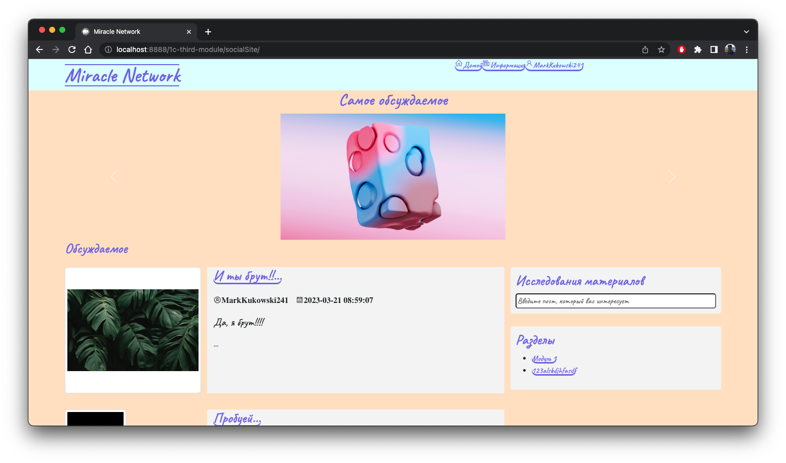
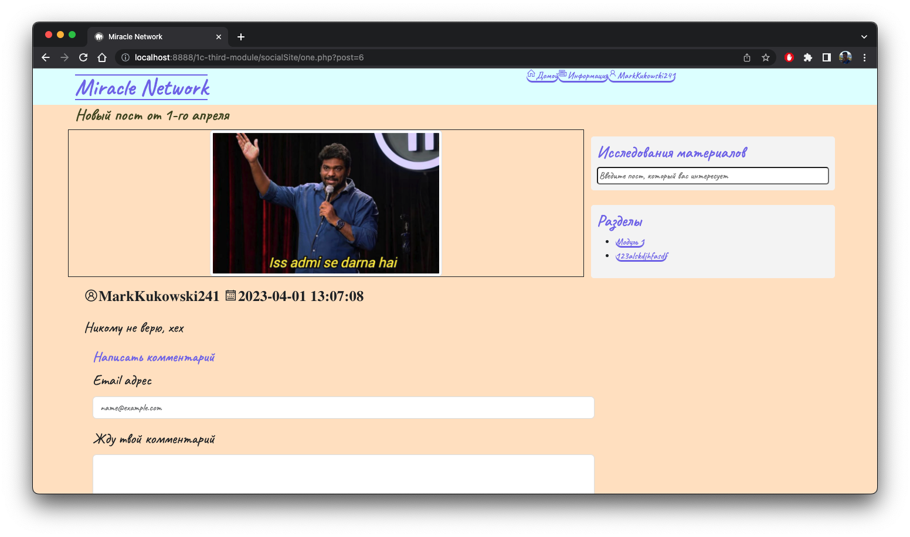
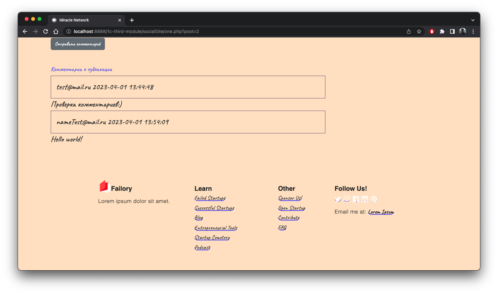
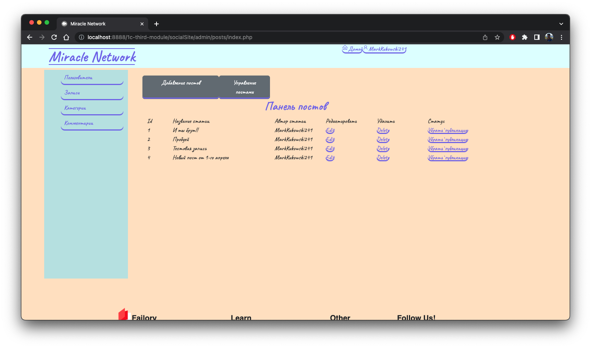
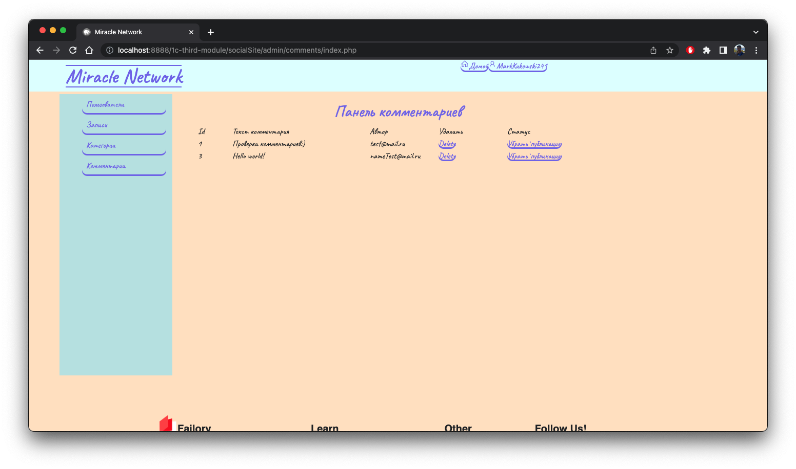

## Данный проект создат на базе программы "Разработчик компьютерных игр, сайтов и бизнес-приложений" от 1С:Образование.

### Постарался соблюсти оригинальное содержание курса

### Список технологий

- PHP Version 7.4.21 - база на которой всё написано :)
- Bootstrap - формы и расположение эллементов
- icons8 - иконки на сайте
- MySQL - база данных в которой хранятся все данные
- CKEditor - для удобного редактирования статей

#### Ниже приведены скриншоты результата прохождения курса

|  |
| :-----------------------------------------------------: |
|                   _Главная страница_                    |

|  |
| :---------------------------------------------------------------: |
|                   _Открытая страница с постом_                    |

|  |
| :-------------------------------------------------------------------------------------: |
|                                  _Комментарии к посту_                                  |

|  |
| :--------------------------------------------------------------------------: |
|       _Возможность редактировать, снимать с публикации, удалять посты_       |

|  |
| :---------------------------------------------------------------------------------: |
|         _Возможность модерации комментариев, удалять и менять их видимость_         |
